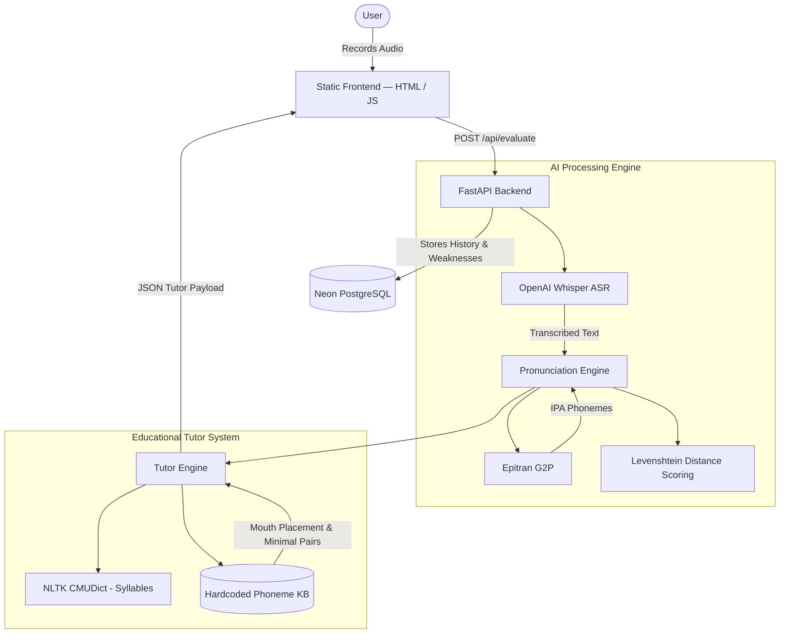

# AI Pronunciation Tutor


A full-stack intelligent learning platform designed to help users understand, visualize, and correct their English pronunciation mistakes. 

Traditional language apps provide a simple "pass/fail" score when you speak. **AI Pronunciation Tutor** goes deeper by identifying exactly *how* you mispronounced a sound, providing physical articulation instructions, and generating personalized learning paths to fix it.

**Live Demo:** [Hugging Face Space](https://alimehdi973-ai-pronunciation-coach.hf.space)  
*(Optional: Insert a link to a Loom Walkthrough video here)*

<p align="center">
  <!-- Placeholder for a high-quality GIF showing the Tutor Modal popping up -->
  
</p>

---

## Why This Project?

Most pronunciation scoring tools suffer from the **"Black Box Problem"**—they tell a user their pronunciation is 60% accurate but fail to explain *why* or *how* to improve. 

This project was built to bridge the gap between machine learning transcription and linguistic pedagogy. By combining OpenAI's Whisper ASR with an explainable phoneme-level grading system (using Epitran and CMUDict), the platform acts as a digital speech therapist: diagnosing errors, explaining the physical mechanics of articulation, and surfacing targeted exercises.

---

## Core Features

### 🧠 Intelligent Tutoring & Explainable Scoring
- **Phoneme-Level Diagnostics:** We don't just score words; we score sounds. The engine compares expected IPA phonemes against transcribed speech to pinpoint exact sound substitutions (e.g., swapping `/w/` for `/v/`).
- **Mouth & Tongue Guidance:** For every mistaken sound, the tutor provides actionable, physical instructions (e.g., *"Place the tip of your tongue slightly between your upper and lower teeth and blow air gently"*).
- **Syllable & Stress Breakdown:** Visual breakdowns of words into syllables with clear stress markers.

### 📈 Progress Tracking & Personalized Learning
- **Weak Phoneme Detection:** The system automatically aggregates your history to identify your most historically problematic sounds.
- **Targeted Practice Dashboard:** Generates dynamic practice sentences heavily featuring your specific weak phonemes.
- **Minimal Pair Exercises:** Contrastive practice (e.g., "think" vs "sink") to help users hear and feel the difference between easily confused sounds.
- **Analytics:** Visualize your pronunciation score trends and improvements over time.

### ⚙️ Dynamic Practice Modes
- **Adaptive Difficulty:** Beginner, Intermediate, and Advanced modes that scale the leniency of the scoring algorithm.
- **Repeat-After-Me:** High-quality, precise word-level audio playback at slowed rates using native `speechSynthesis`.
- **Custom Text Practice:** Practice your own scripts, speeches, or vocabulary lists.

---

## System Architecture



---

## Tech Stack

- **Backend:** Python 3.11, FastAPI, Uvicorn
- **AI / NLP Models:** OpenAI Whisper (ASR), Epitran (G2P Phoneme Translation), NLTK (CMUDict)
- **Data & Analytics:** PostgreSQL (Neon) for production, SQLite for local dev, SQLAlchemy ORM
- **Frontend:** Vanilla HTML5, CSS3, JavaScript (Zero-build pipeline for maximum performance), Chart.js
- **Containerization:** Docker

---

## Installation & Running Locally

### Prerequisites
- Python 3.11+
- `ffmpeg` available on your system `PATH` (Required for Whisper audio decoding)
- (Recommended) [`uv`](https://docs.astral.sh/uv/) for incredibly fast, deterministic Python dependency management.

### Setup Instructions

```bash
# Clone the repository
git clone https://github.com/alimehdikhan/A.I-Pronunciation-Coach.git
cd A.I-Pronunciation-Coach

# Create and activate a virtual environment
python -m venv venv
source venv/bin/activate  # On Windows: .\venv\Scripts\activate

# Install dependencies (using uv for speed, or fallback to pip)
uv pip install -r backend/requirements.txt
uv pip install -r backend/requirements-dev.txt
```

### Running the Application

```bash
python -m uvicorn backend.main:app --reload --host 0.0.0.0 --port 8000
```
Visit `http://localhost:8000` in your browser.

> **Note:** The first startup may take 30–120 seconds while the Whisper model downloads to your machine. 
> To skip model loading temporarily (useful for UI-only development), set: 
> `export PRONUNCIATION_COACH_LOAD_MODELS_ON_STARTUP=0`

---

## Configuration

All configuration is done via environment variables. See [`.env.example`](.env.example) for defaults.

| Variable | Default | Description |
|---|---|---|
| `DATABASE_URL` | `sqlite:///./pronunciation_coach.db` | PostgreSQL connection string (e.g. Neon) or local SQLite path |
| `WHISPER_MODEL_SIZE` | `base` | Whisper model size (`tiny`, `base`, `small`, `medium`, `large`) |
| `PRONUNCIATION_LANGUAGE` | `eng-Latn` | Epitran language code for phoneme generation |
| `PRONUNCIATION_COACH_LOAD_MODELS_ON_STARTUP` | `1` | Set to `0` to skip loading models at startup |
| `PRONUNCIATION_COACH_MAX_UPLOAD_BYTES` | `26214400` | Maximum upload size in bytes (default 25 MB) |
| `PRONUNCIATION_COACH_CORS_ORIGINS` | localhost | Comma-separated allowed origins |

---

## API Endpoints

| Method | Path | Description |
|---|---|---|
| `GET` | `/health` | Health check and model readiness |
| `POST` | `/api/evaluate` | Evaluate pronunciation (audio + target text) |
| `POST` | `/api/transcribe` | Transcribe audio without scoring |
| `GET` | `/api/tutor/card` | Fetch instructional phoneme placement guide |
| `GET` | `/api/tutor/personalized-practice/{username}` | Fetch targeted minimal pair exercises based on user history |

### Example: Evaluate pronunciation

A sample audio file is included for quick API testing:

```bash
curl -F "audio=@tests/sample.wav" \
     -F "target_text=Today is a beautiful day." \
     http://localhost:8000/api/evaluate
```

---

## Testing & Verification

The project includes a lightweight, highly-mocked `pytest` suite to verify scoring logic and tutor generation without requiring heavy model initialization.

```bash
pytest -q
```

---

## Deployment Instructions

### Docker

The application is containerized and ready for cloud deployment.

```bash
docker build -t pronunciation-tutor .
docker run -p 8000:8000 pronunciation-tutor
```

### Hugging Face Spaces

This project natively supports Hugging Face Spaces using the Docker template. Push your code directly to your Space remote to trigger an automated build and deployment. Ensure your Space is configured to expose port `8000`.

---

## Future Roadmap

- **Generative AI Integration:** Upgrade the static Phoneme Knowledge Base with a fallback LLM (like Gemini or GPT-4o) to handle edge-case accents and non-standard dialects dynamically.
- **Multilingual Support:** Expand Epitran and Knowledge Base support to Spanish and French.
- **Gamification:** Introduce daily streaks, achievements, and spaced repetition for personalized minimal pairs.

---

## License

MIT License
